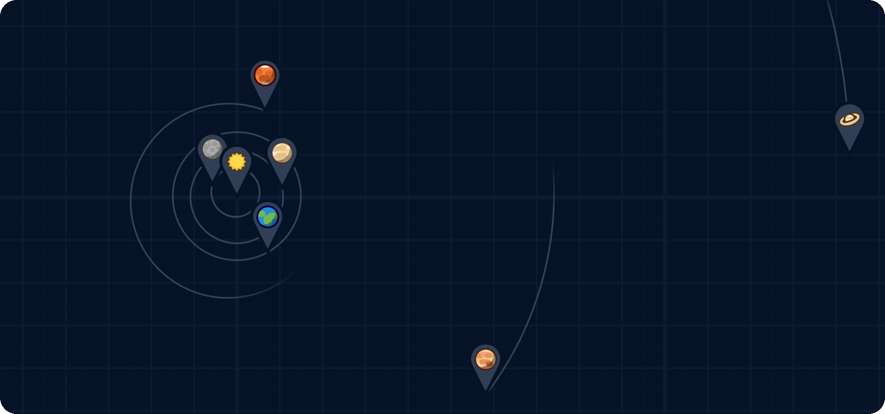
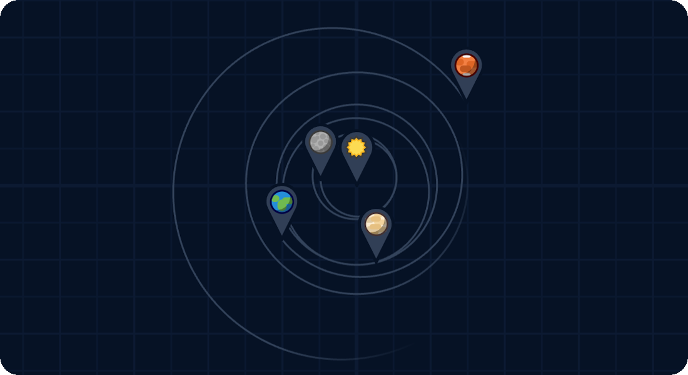
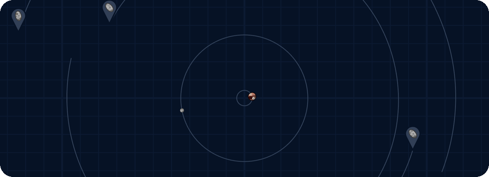
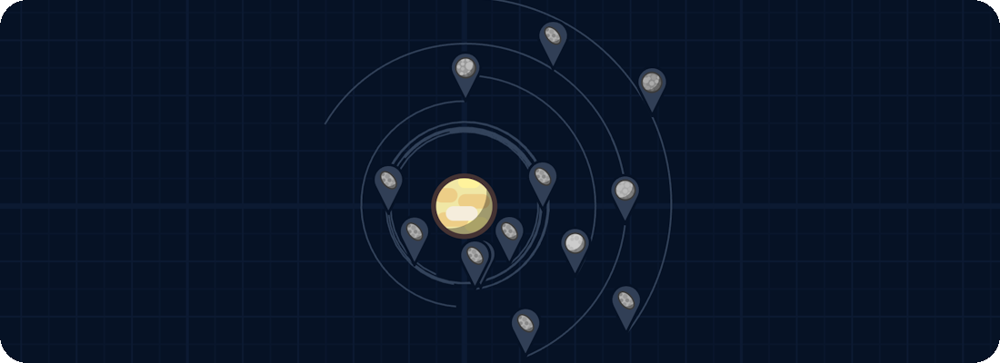
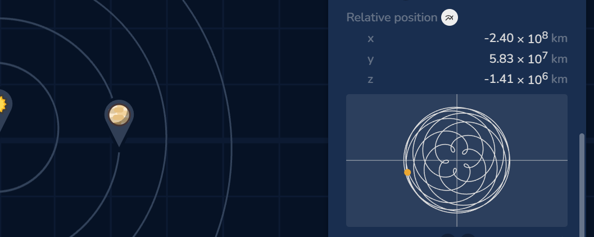
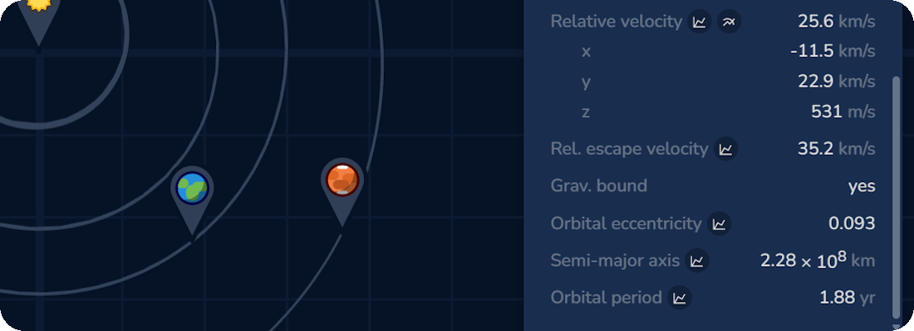

# Interactive Gravity Sim



This is the repository for the [interactive gravity sim](https://dirck.dev/gravity-sim) web app. In this application objects with mass can be placed in a 3D space, which will simulate the gravitational interactions between the objects (without taking relativity into account). Some preset scenarios can be loaded right away.

## Development

I likely won't be working on the application for the forseeable future. If you'd like to implement something yourself, feel free to fork the repository :)

See also the [LICENSE](./LICENSE) file for allowed usage.

The app is built using Vue.js with Vite. The core simulation code is written in Rust and compiled to WebAssembly.

### Setup

First clone the repository from GitHub. Make sure you have Rust, Cargo, Node.js, and npm installed. Install the required npm packages locally using `npm install` in the repository directory. Also install the Rust wasm-pack crate using

```sh
cargo install wasm-pack
```

### Building and development

Running the command `npm run build` will first compile the Rust code to WebAssembly, then build the Vue app with Vite. The output will is a static site, found in the dist directory.

To develop the app locally you can use Vite's `npm run dev` to create a local webserver that refreshes automatically. This will also enable some developer tools for performance measurements and component inspection.

Note that the Rust code is not automatically compiled when it is changed, even when running `npm run dev`. The Rust code can be compiled separately using `npm run build-rust-dev`. This will also add debug markers to the WebAssembly, such that performance measurement tools like Chrome's DevTools can display the proper function names.

## File format

The simulator uses a custom file format ".grav", which contains JSON encoded data of the state of the system. These files conform with the JSON schema found [here](./src/assets/json/save.schema.json). For more information on the file format, read the [documentation](./docs/fileformat.md).

## Examples

Below are some usage examples of the sim. Keep in mind there is much more to discover!

### What if the sun suddenly becomes 10% more massive?



### Pluto system



### Visualize velocities and accelerations


### Saturn's moons



### Plot relative positions between objects



### Display 2-body orbital characteristics

